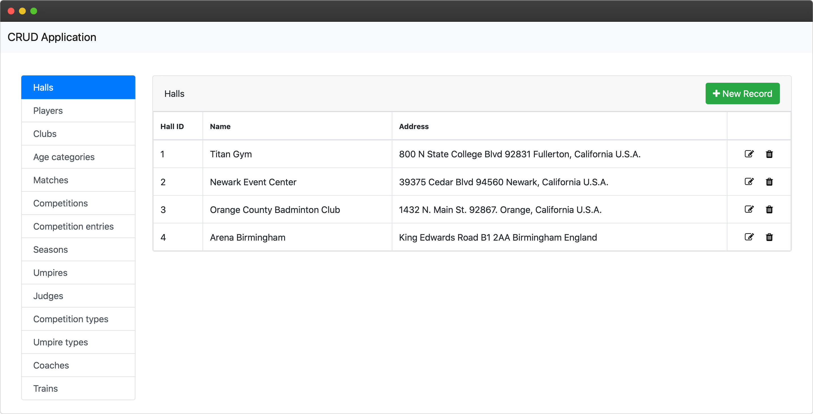
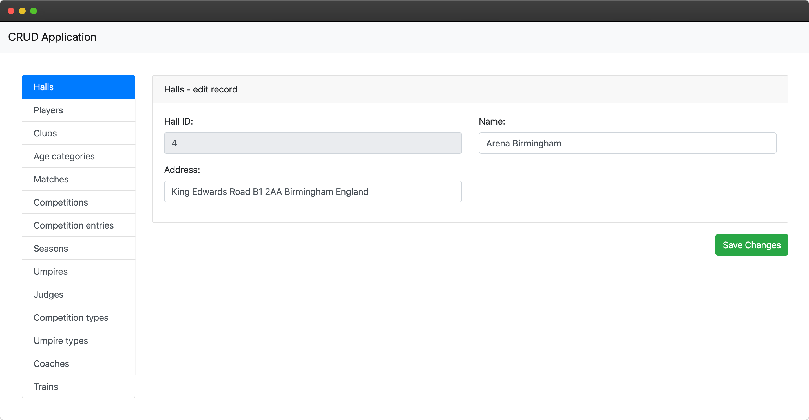
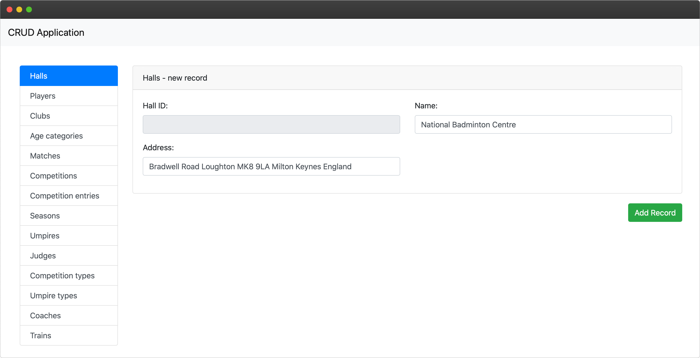
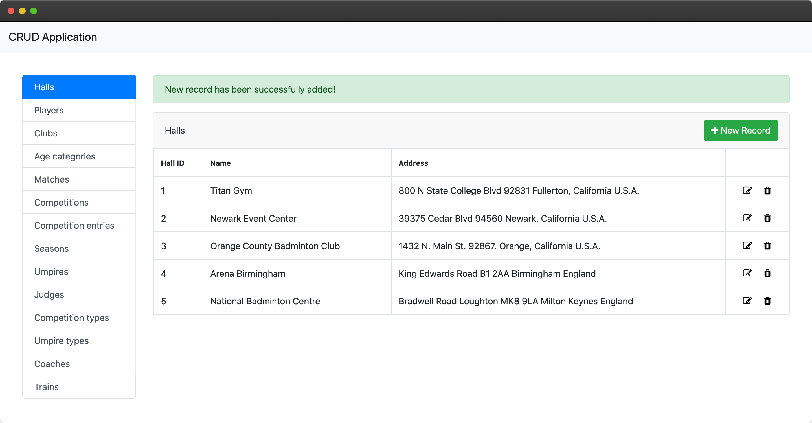
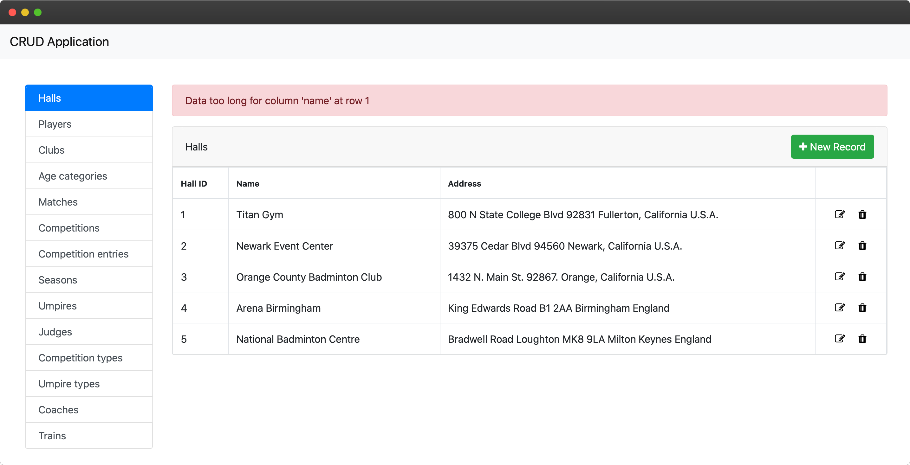

# Basic dynamic CRUD web application
This is a basic CRUD (Create, Read, Update, Delete) web application made in a few hours which dynamically adapts to the database structure. Nothing regarding a specific database has been hard coded - the application will allow CRUD operations on any MySQL database you connect it to. Forms for inserting new records and tables for showing data from tables are dynamically created based on the table structure.

## Made on
- 12.1.2020.

## Technologies used:
- HTML
- CSS
- PHP
- MySQL
- Bootstrap Framework

## Features

- offers basic CRUD operations for any MySQL database - nothing regarding a specific database has been hardcoded
- forms for inserting and editing data are dynamically created based on the structure of the selected table

## Implementation
The main problem was how to display proper table and column names in the application. For example, I didn't want to display column "hall_id" as "hall_id" but as "Hall ID". I took advantage of column comments to solve this.

Each column in database has a comment which is displayed as column header in the application:

```sql
ALTER TABLE hall MODIFY hall_id INT(11) COMMENT 'Hall ID';
```

Each table in database has a comment which is displayed as the table name in the application:

```sql
ALTER TABLE hall COMMENT = 'Halls';
```

 
## Screenshots


*Displaying data from selected table*


*Editing an existing record*


*Adding a new record*


*When new record has been successfully added*


*When an error occured while inserting a new record*
